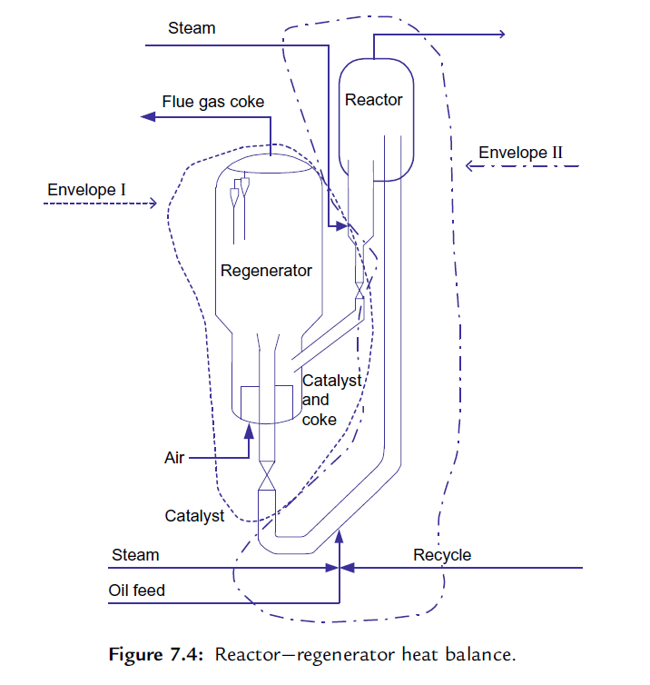

Unit Monitoring and Control/装置的监控      
# FCC装置监控

监控催化裂化装置性能的正确方法是对装置进行周期性的物料平衡和热平衡测算。经常进行这些测试，就能收集、判断和评估装置的操作数据。      

理解催化裂化装置的操作也需要对装置的热平衡知识有深入的了解。原料性质、操作条件、催化剂或机械构造的任何变化都将影响热平衡。热平衡在预测和评估影响FCC产品的数量和质量的变化方面是一个重要的工具。     

## 物料平衡 
Material Balance    

在进行任何物料平衡计算的过程中，第一步是确认进料和出料，通常可通过围绕进料和出料画一个封闭线来完成。        
        

!!! note ""     
    Tail gas`尾气`； Flue gas/coke`烟气/焦炭`； Recycle Main column and gas plant`主分馏塔和气体分馏装置`       

进行物料平衡测算的主要目标之一是确定离开反应器的产品组成，进入主分馏塔的反应器流出的气相物流含有烃、蒸汽和惰性气体。以重量计，在反应器顶部物流中的烃等于新鲜进料加上循环物料中的烃，再减去转化成焦炭的那部分进料中的烃。    

反应器的气相中蒸汽的主要来源是：提升管的提升蒸汽、进料喷嘴的雾化蒸汽、反应器顶部蒸汽和汽提蒸汽。    
>有些FCC装置专门在进料注入系统注入水以作为从再生器回收热量的一部分。取决于反应器压力的大小及催化剂的循环速率，约有25%-50％的汽提蒸汽被待生催化剂夹带到再生器中，这部分蒸汽应被扣除。    

惰性气体，例如氮气、一氧化碳和二氧化碳，被再生催化剂带入提升管。这些惰性气体的量与催化剂的循环速率成正比这些惰性气体流经FCC的气体分馏装置，并随二级吸收塔的干气离开装置。在进行物料平衡计算时，这些惰性气体的流速应该被扣除。   

FCC产品的产率通常以不含惰性气体为基础，以占新鲜原料的体积分数和质量分数表示。**转化率**的定义为：原料被转化成汽油和其他轻质产品（包括焦炭）的体积或质量百分数。然而，转化率典型的计算方法是：新鲜原料减去比汽油重的液体产品的体积或质量，再除以新鲜进料的体积或质量，可表示如下：       
$$ \text{转化率%} = \dfrac{\text{新鲜进料}-(\text{LCO产品}+\text{HCO产品}+\text{油浆产品})}{\text{新鲜进料}} \times 100 $$   

>在严格的物料平衡中，汽油、轻循环油(LCO)和油浆的产率以及装置的转化率是基千固定的下点。通常汽油的干点(TBP)是430°F（221°C），LCO的干点(TBP)是670°F（354°C）。采用固定的干点使反应产率免受蒸馏系统性能的影响。     
>根据季节的需求，汽油的干点可以在360-450°F（182-232°C）变化，将汽油的干点切低会增加LCO的产率，并出现低的转化率。因此，真实转化率是在汽油、LCO和油浆产品的切割点调整之后计算的。     

### 试验方法
Testing Methods     

进行提升管的物料平衡计算需要反应器流出物的组成。        

## 热平衡   
Heat Balance        

催化裂化装置是拒绝焦炭的工艺装置，它通过自我的连续调节来保持热平衡，这意味着反应器和再生器的热流必须相等。  
     

>热平衡计算可以围绕反应器或汽提段—再生器进行，也可以围绕反应器—再生器进行一个总的热平衡计算。汽提段—再生器的热平衡可用于计算催化剂的循环速率和剂油比。      

简单地说，装置产生和燃烧足够的焦炭以提供以下能量：      

* 气化新鲜进料及任何循环物流；  
* 提高新鲜进料、回炼油和雾化蒸汽的温度，使其从预热状态达到反应器温度；  
* 提供裂化所需吸收的热量；  
* 提高燃烧用主风的温度，使其由鼓风机出口温度提高到再生器稀相温度；  
* 补充从反应器和再生器散失到周围环境中的热量损失；  
* 为换热器提供热量，例如汽提蒸汽和催化剂冷却。  

### 汽提段——再生器的热平衡
Heat Balance Around Stripper-Regenerator    

如果达不到待生催化剂可靠的温度，汽提段就需要包含到[反应器一再生器热平衡图](#热平衡)所示的热平衡封闭线(II)`Envelope II`中。   
再生器中焦炭的燃烧应满足下列热量需要：      

* 为将空气从主风机出口温度提高到再生器稀相温度提供热量；    
* 为焦炭从待生催化剂上**脱附**提供热量；    
* 为将**汽提蒸汽**的温度提高到反应器的温度提供热量；    
* 为将催化剂上的焦炭从反应器的温度提高到再生器的密相温度提供热量；      
* 为将焦炭燃烧产物从再生器密相温度提高到烟气温度提供热量；      
* 为补偿再生器的热损失提供热量；    
* 为待生催化剂从反应器温度提高到再生器密相温度提供热量。    

### 反应器的热平衡
Reactor Heat Balance    

热再生催化剂供给液体进料（及任何回炼物料）汽化所需的全部热量，提供裂化反应所需吸收的全部热量，并把分散蒸汽和惰性气体的温度提高到反应器温度。    

**热量进出表**      

| 带进热量 | 带出热量 |
| -------- | -------- |
| 新鲜进料 | 反应油气 |
| 回炼物料 | 烟气     |
| 空气     | 热量损失 |
| 蒸汽     |          |

在FCC装置中，反应热是很有用的工具。首先它是热平衡准确度的一个间接指标。其次，定期监测反应热的变化趋势可以洞察提升管内发生的反应及进料和催化剂变化的影响。   

### 结果分析
Analysis of Results     

完成了物料平衡和热平衡计算之后，需出具报告。首先把这些数据列出，然后讨论影响产品质扯和造成反常结果的因素，并提出重要发现和改进装置操作的建议。  

## 压力平衡 
Pressure Balance    

压力平衡与反应器/再生器系统中催化剂循环的水力学有关。研究压力平衡从反应器—再生器系统的单表压调查开始，总的目的如下：    

* 确保催化剂循环稳定；  
* 最大化催化剂循环量；  
* 最大化滑阀压降；  
* 最小化主风机和富气压缩机(WGC)的负荷。     

为了充分利用一个装置，清楚地认识压力平衡是极端重要的。为了增加处理能力，可以从提高催化剂的循环量入手，或从改变反应器—再生器之间的压差以降低富气压缩机(WGC)或空气主风机的负荷入手。必须知道如何操纵压力平衡来识别装置“真正＂的制约因素。

### 流态化基本原理
Basic Fluidization Principles   

流化催化剂的性状像液体，催化剂向压力较低的方向流动。床层中任何两点之间的压力差等于这两点之间床层的静高度差乘以流化催化剂的密度，这种计算方法仅限于催化剂是流化的。      
只有当压力是通过催化剂颗粒传递，而不是通过容器壁传递时，FCC催化剂才能够像液体一样流动。当催化剂进行循环时，催化剂必须保持流化状态。     

### 反应器—再生器系统的主要组成部分
Major Components of the Reactor-Regenerator Circuit     

反应器—再生器系统中产生或消耗压力的主要部分如下：   

* 再生器催化剂料斗；    
* 再生催化剂立管；  
* 再生催化剂滑阀（或塞阀）；    
* 提升管；  
* 反应器—汽提段；   
* 待生催化剂立管；  
* 待生催化剂滑阀（或塞阀）。    

#### 再生器催化剂料斗
Regenerator Catalyst Hopper     

有些FCC装置，再生催化剂先流经一个料斗然后进入立管。料斗一般设在再生器内部，再生催化剂进入立管前，该料斗可以提供足够的停留时间使再生催化剂脱气，这样使得进入立管的催化剂具有最大的流动密度。催化剂流动密度越高，立管中的蓄压就越大。有些FCC装置的设计，再生催化剂料斗设在再生器外部，通过调节松动风来控制进入立管的催化剂的密度。    

#### 再生器催化剂立管
Regenerated Catalyst Standpipe  

立管的高度提供催化剂从再生器输送到反应器的推动力。立管入口与滑阀之间的高度差就是该蓄压的来源。      
$$ \Delta p = \rho gh  $$
$\rho$催化剂的流动密度，$h$高度差      
获得最大蓄压的关键是保持整个立管长度方向的催化剂处于**流化状态**。  
较长的立管需要**外部松动气**，这个松动气用于携带的烟气沿立管下移时被压缩的补充。松动气应当沿立管长度均匀注入。较短的立管常常有足够的烟气被再生催化剂携带下移使催化剂保持流化状态，而不必补充松动气。松动气过大会导致催化剂流动不稳定，必须避免。      
除了适当的松动气以外，流动的催化剂必须含有足够的0~40μm细粉以及最少量的150μm颗粒以避免脱流化。

#### 再生器催化剂滑阀
Regenerated Catalyst Slide Valve    

设置再生催化剂滑阀有3个目的：   

* 调节再生催化剂进入提升管的流量；  
* 维持立管的压头；  
* 防止催化剂倒流入再生器。  

催化剂流过滑阀的压降通常是1-8psi(7-55kPa)。     

#### 提升管
Riser   

热的再生催化剂沿提升管向上输送，然后进入反应器—汽提段。携带催化剂与油气混合物的驱动力来自提升管底部较高的压力和催化剂/油气混合物的低密度。      
再生器中流化的催化剂（约40$lb/ft^3$或640$kg/m^3$）和提升管中裂化的胫蒸气与催化剂混合物（约11$lb/ft^3$或16$kg/m^3$）之间的**大密度差**使得催化剂从再生催化剂滑阀循环至反应器壳体内。     
在压力平衡中，这一输送催化剂过程产生的压力降范围为5-9psi(35-62kPa)。该压力降是由催化剂从滑阀下游到进料喷嘴的静压头、提升管中催化剂的静压头、流体摩擦和提升管及其末端设备中催化剂/油气的加速度损失而产生的。     
>现有的提升管因操作变化，例如催化剂循环量高，或油气速度低，会影响反应混合物的密度，增加压降，从而影响滑阀的压差和操作开度。   

#### 反应器—汽提段
Reactor-Stripper    

反应器—汽提段中催化剂床层的重要性有以下3个原因：    

1. 为待生催化剂在进入再生器前提供足够的停留时间，以便汽提携带的烃蒸气；     
2. 为待生催化剂流入再生器提供足够的静压头；     
3. 提供足够的背压，防止高温烟气倒流进入反应器系统。     

静压头：    
$$ \Delta p = \rho gh  $$
$\rho$催化剂密度，$h$床层料位高      

#### 待生催化剂立管
Spent Catalyst Standpipe    

待生催化剂从汽提段底部流入待生催化剂立管。有时，待生催化剂在汽提段锥体内会部分脱流化。为此，通常在待生催化剂进入立管前通入“干”蒸汽（通过分配器）使待生催化剂流化。  
汽提段锥体内流化状态的损失会引起密相催化剂沿锥体壁的堆积。这种催化剂堆积会制约催化剂流入立管，引起流动不稳定，降低立管中的蓄压。    
与再生催化剂立管一样，待生催化剂立管可能也需要补充松动气以获得最佳的流动特性。通常用“干”蒸汽作为松动气介质。    
#### 待生催化剂滑阀或塞阀
Spent Catalyst Slide or Plug Valve  

待生催化剂滑阀位于立管底部，用于控制汽提段催化剂床层料位高度，调节待生催化剂进入再生器的流量。与再生催化剂滑阀相同，只要催化剂流化，汽提段催化剂料位就会产生压力。  

## 小结
评价催化裂化装置性能唯一恰当的方法是进行物料平衡和热平衡测算。  
物料平衡试验运行为日常监测提供了一个标准而一致的方法。通过它可以准确分析产率和装置性能的发展趋势。  
热平衡测算提供了一个对装置操作进行深入分析的工具，热平衡调查可以确定催化剂的循环速率、炭差和反应热。    
压力平衡提供了对催化剂循环水力学的深入了解。进行压力平衡调查可以帮助装置工程师识别“夹点”`pinch points`。

-----

最近的修改: {{ git_revision_date }}