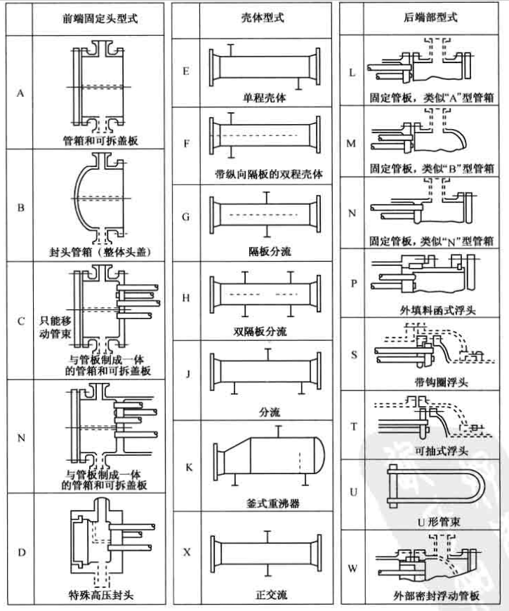

Heat Exchanger/换热器
# 换热器总述

### [**管壳式**](snt.md)
传热面积等级较多，选择余地最大  
管外径规格(管心距)：  $\phi19 \times 2 （25mm）$ 或 $\phi25 \times 2.5 （32mm）$

管壳式换热器主要有三种形式：

* *浮头式*  
   
  管壳温差不受限制、管束便于更换、壳程机械清扫

* *固定管板式*
    
  造价低、经济，温差较小，壳程压力低，壳程结垢不易清洗

* *U型管*
  
  高压时选用

换热器可以采用多种不同的壳体形式，国标采用的是TEMA标准。TEMA对管壳式换热器壳体类型进行了规定。      
TEMA标准     
   

### **板式**
适合流量小、PT低、具有腐蚀性、粘度高的介质  

**Advantage：**  
    体积小  
    设备紧凑  
    金属耗量小  
    传热效能高  

**Disadvantage：**  
    结构垫片限制，不适宜高温高压 

### **套管式**
流量小但压力、温度高

### **管箱式**
老式换热器

