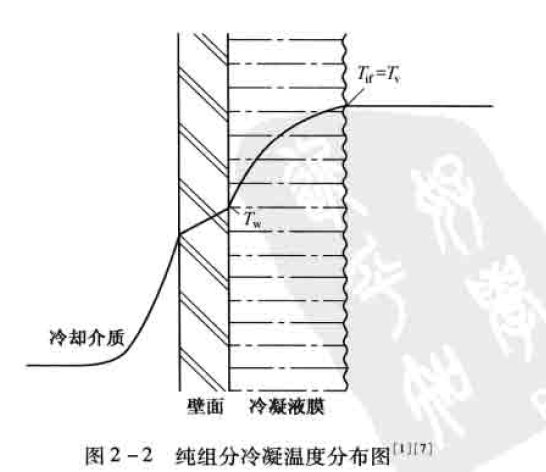
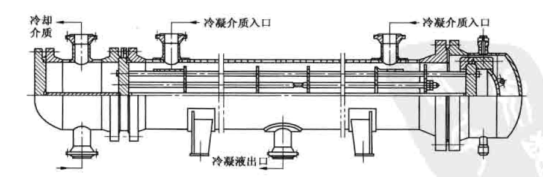

冷凝器

# 冷凝机理分析及设计考虑因素
## 冷凝机理分析
### 概述
当蒸汽与低于其饱和温度的壁面相接触时会冷凝成液体,同时放出汽化潜热并传递给壁面,这种热交换过程称为**冷凝传热**。      
一般来说,单组分的冷凝传热是一种高效传热过程,它的传热系数高于同种流体的单相对流传热系数。但对于含不凝气的混合物冷凝,因不凝气的存在使冷凝传热系数大大降低。     
两相流动传热的冷凝过程,应用十分广泛,如蒸馏塔顶汽体馏出物的冷凝、水蒸气的冷凝、冷冻剂蒸汽的冷凝等。   
在冷凝过程中涉及到的主要设备有:管壳式冷凝器、空气冷却器、板式冷凝器和螺旋板式冷凝器等。     

冷凝传热过程大致分为以下类型:   
按冷凝面的==基本几何参数==,可分为管内冷凝和管外冷凝。管内冷凝包括水平管、垂直管和倾斜管;管外冷凝包括垂直单管及管東,水平单管及管束     
按==管子类型==可分为光管、螺纹管(低翅片管)、沟槽管等    
按蒸汽的==流体动力学==可分为:低速(重力控制)和高速(剪力控制)两种动力学状态。     
按==组分==的数目和性质可分为:单组分、多组分混合物(冷凝液互溶和不互溶两种)、含不凝气的混合物     
按==冷凝方式==可分为:*膜状冷凝*、*滴状冷凝*、*直接接触冷凝*、*均相流冷凝*等。   

* *均相流冷凝*发生在有小颗粒存在的时候,由于出现不期望的雾化现象,在设计中不作为主要问题考虑。    
* *直接接触冷凝*需要将冷凝汽体和冷却介质混合,在加工工业中很少采用。     
* 除上述两种情况外,在冷凝过程中通常会出现两种情况:    
    + 一种是冷凝液能很好地润湿壁面,在壁面上形成一层连续的液膜。冷凝过程只在液膜与蒸汽的分界面上进行,冷凝放出的汽化潜热必须穿过这层液膜才能传到冷却壁面上去,这种冷凝方式称为*膜状冷凝*。这时,**液膜层就成为主要的传热阻力**。    
    + 而另一种情况是冷凝液不能很好地润湿壁面,冷凝液在壁面上形成一个个小液珠,且不断发展长大。液珠长大之后,由于受重力的作用,会不断地携带着沿途的其它液珠沿壁面流下,使壁面重复液珠的形成和成长过程。冷凝放出的汽化潜热可直接传递给壁面,这种冷凝方式称为*滴状冷凝*。    
>滴状冷凝的传热速率比膜状冷凝高,可以达到几倍甚至十几倍。其原因是蒸汽与管壁直接接触,中间没有比管壁导热系数小很多的液膜存在;同时传热的推动力是燕汽温度与管壁温度之差,这比膜状冷凝时的汽液界面温度与管壁温度之差要大。尽管滴状冷凝的传热效果很好,但在操作上不稳定,而且它所需要的特殊材质的冷凝表面也很难完全满足，因此,工业应用仍很有限。     

### 膜状冷凝的特点
#### 纯组分与小温差介质的冷凝      

对纯组分冷凝,汽相温度场是平坦的,换句话说,气体到达汽液界面时不存在传质阻力,界面温度等于汽相主体温度。    
对纯组分冷凝,由于不存在汽相的传质阻力,且冷凝温差推动力是汽相主体温度与管壁温度之差,因此冷凝传热效率非常高,即冷凝传热系数非常高。对于小温差介质或窄馏分冷凝,尽管存在汽相传质阻力,但很小可忽略不计,近似当纯组分处理。     
   

#### 含不凝气混合物冷凝与大温差介质的冷凝      

如果汽体中含不凝气,那么在汽相中就会产生额外的温降$(T_V-T_{if})$,大温差介质冷凝也会出现此现象。这个温差的产生,是由于必须有一个分压差去迫使蒸汽穿过不凝气到达汽液界面所致。    
       
汽液界面处的蒸汽分压等于界面温度对应的饱和蒸汽压,在界面处蒸汽分压降低了,相应的饱和温度也降低了。可凝汽体混合物冷凝时也会产生类似的汽相温降。因此含不凝气冷凝的温差推动力是$(T_{if}-T_w)$,而不是纯组分的$(T_v-T_w)$，在其他条件相同的情况下，其冷凝传热效率比春组分冷凝时低。    

#### 流态预测      

水平管内的冷凝可划分为两个主要的流态:**汽体剪力控制**流动和**重力控制**流动。对于水平管束外的冷凝,同样可以划分为上述两个主要流态。     
剪力控制流态,汽体和液体都沿着剪力方向流动;而重力控制流态,液体沿重力方向流动,并可能与汽相物流分离。      
预测这两种流态是非常重要的,在冷凝传热计算方法中要用到。确定液体负荷量或相对液体体积量也很重要,在低液体负荷下,汽体总是连续相;在高液体负荷下,液体可能为连续相,此时会形成弹状流或者泡状流。液体负荷是均相液体体积分率的函数或者是Martinelli参数的函数。    
确定冷凝过程的流态需要有一个判别参数,称其为**流型参数**。   

#### 过热与过冷现象    

汽体进入冷凝器有时处于**过热**状态,即汽体温度高于其露点温度。   
如果管壁温度低于汽体露点温度,称为==湿壁状态==。在这种情况下,传热系数按饱和汽体冷凝计算,平均温差(MTD)按露点温度计算,而不是过热汽体温度。 
如果管壁温度高于汽体露点温度,称为==干壁状态==。蒸馏塔顶冷凝器很少见干壁状态,但对进料一流出物换热器则会发生。在这种情况下,近管壁处不会形成冷凝液膜,传热系数按单相气体显热传热计算,用气体的实际温度计算平均温差。     
当过热段占较大比例时,可能先经历一段干壁传热,再过渡到湿壁传热。一般来说,只有当冷流体的出口温度比较接近热流体的露点温度,且过热段占较大比例时才可能出现干壁现象,事实上这种情况很少遇到。   

在全凝器中通常期望出现一定程度的**过冷**。在冷凝液抽出体系中,过冷可以防止发生闪蒸。因为冷凝液用泵抽出时出现闪蒸会产生气阻现象,对泵的操作有影响。但并不推荐在冷凝器中设计大量的过冷,尤其是卧式冷凝器。主要有两个方面的原因:  
其一是低液体速度使得传热系数非常小;     
其二是几乎不可能准确预测真实的液位高度和平均温差,因此传热系数难以计算。      

因为这些原因,从可靠性和经济性出发,通常采用一台单独的换热器来处理过冷负荷。如果在冷凝器中需要过冷时,最好选用立式管内冷凝,而最不利的结构形式是卧式管内冷凝。卧式壳程冷凝器有时通过冷凝液淹没部分管子,达到过冷的目的。尽管淹没部分的传热系数非常低,但只要将冷凝器的设计余量留大一些,还是切实可行的。

### 膜状冷凝的基础模型
当汽体与低于其露点温度的表面接触时就会发生冷凝,覆盖在表面上的液膜厚度与冷凝液流率以及液膜是由重力还是由剪力带走有关。液膜表面温度基本上等于汽体的饱和温度,实际上液膜界面温度稍低于汽体饱和温度,因此从理论上分析两相界面处存在传热阻力。但从实际观点出发,因为界面热阻很难确定,并且界面热阻即使存在也很小,因此对大多数冷凝过程都可以忽略不计,但液态金属冷凝例外。一般情况下可以假定界面温度等于饱和温度。     
壁温必须低于饱和温度以克服液膜的传热阻力。冷凝液膜传热系数$h_{cf}$将穿过液膜的热通量与界面和壁面之间温差关联:   

$$ q= h_{cf} \cdot (T_{if}-T_{w}) $$

对混合物，冷凝液饱和温度低于气体温度，因此要考虑气相传热阻力。气相传热系数$h_{v}$将来自气象的热通量与气体和界面之间的温差关联：     

$$ q= h_{v} \cdot (T_v-T_{if}) $$

!!! info ""     
    $q$热通量,$W/m^2$；     
    $h_{cf}$液膜传热系数,$W/(m^2 \cdot K)$；    
    $T_{if}$气液界面温度,℃；   
    $T_w$壁温,℃    
    $h_v$气相传热系数,$W/(m^2 \cdot K)$；  
    $T_v$气相主体温度,℃     

1.冷凝液膜传热系数

计算冷凝液膜传热系数需要两种机理模型,同样解释重力控制流动和剪力控制流动也需要两种机理模型,这两种机理模型分别为努塞尔特模型和对流模型。  

**修正的努塞尔特模型**:用于重力控制流动的低液体负荷。&emsp;&emsp;对努塞尔特公式进行修正后,重力控制液膜传热系数与液膜雷诺数、表面几何参数有关。  
努塞尔特对垂直壁面上的纯组分蒸汽冷凝进行研究,建立了重力控制下的蒸汽冷凝物理模型,从理论上对冷凝传热过程进行分析,导出了计算冷凝传热膜系数的数学模型。     

**对流模型**:用于高液体负荷以及低液体负荷下的剪力控制流动。&emsp;&emsp;此模型是建立在液膜传热的理论分析基础之上,这层液膜被平行于表面的力所剪切,平行于表面的力与两相摩擦压力降有关。     

2.混合物冷凝中的气相传热系数    

对含不凝气的部分冷凝及宽馏分的混合物冷凝，必须计算气相热阻。    

## 冷凝过程设计考虑因素
### 冷凝过程设备形式的选择
在选择冷凝设备时应针对膜状冷凝的特点,结合具体的对象选择设备形式。   

#### 饱和汽体的冷凝
对饱和汽体最好选择在**卧式冷凝器的壳程冷凝**,因为无论从传热、压力降还是清扫等方面都比较合理。   
当冷凝量相同、冷凝器型号也相同时,卧式壳程冷凝的综合传热系数比立式管内或管束外的冷凝==传热系数==高,卧式壳程冷凝==压力降==比管程冷凝小。另外用水作为冷却介质时,冷却水走管内便于清洗水垢。水走管内容易保证较高的流速,这对于降低水垢的生成速度及提高水的膜传热系数都有好处。    

??? info "在某些特殊情况下对于饱和汽体,不一定在卧式冷凝器的壳程冷凝"     
    当冷凝介质**压力很高**,或有严重**腐蚀**需要特殊材质时,在管程冷凝比较合适,这样壳体材料可以用普通碳钢。如果两侧流体都有腐蚀,管子与壳体都需要合金钢材,这时管程与壳程的选择还要结合冷却介质的情况来综合考虑。   
    例如冷却介质**粘度很高**或者**流量较小**时,只有走壳程才能达到**湍流**,从而提高膜传热系数,在这种情况下冷却介质走壳程,冷凝介质走管程比较合适。    
    除此之外,还需要根据两侧的具体情况来全面考虑,例如降低哪一侧的压力降是主要的,以及哪一侧的传热系数是控制因素等。   

#### 含不凝气的冷凝

含不凝气的混合物冷凝冷却可以采用卧式冷凝器,也可以采用立式冷凝器,主要取决于**冷凝介质的压力**。  

* ==低压==:通常采用卧式冷凝器的壳程冷凝,而不易采用立式冷凝器。      
    >因为如果用立式冷凝器在管程冷凝,为了使汽体分布均匀或者有比较合理的传热系数,就必须具有较高的流速,这将导致压力降超出允许的范围;    
    >如果采用立式冷凝器壳程冷凝,在死角累积起来的不凝气不容易排除;同时冷凝液沿管壁流到折流板时,从折流板边缘落到下层折流板上,这就使得冷凝温降较大的宽馏分冷凝液不能很好地与管子接触,冷凝液得不到充分的冷却。     
* ==中压==:如果不存在操作上的问题,采用立式冷凝器在管程冷凝是比较合适的。其优点如下:     
    + 冷凝液呈降膜形式向下流动,对冷凝液过冷有利;    
    + 因气速较高,不仅冷凝液膜厚度较薄,而且汽相的热阻也低,不凝气也不易在冷凝器中积聚;    
    + 在立式的塔顶冷凝器中,汽体与冷凝液始终充分接触,其传热系数比卧式高且压力降较低。    
    另外,在立式冷凝器中如果能做到完全逆流,冷凝液过冷效果就更好。同时出口汽体因与温度最低的管壁接触,可凝气的损失也最少。    
* ==高压==:过去多采用立式冷凝器,现在多采用卧式冷凝器的管程冷凝。对于卧式的,要采用适宜的流速以免汽液分层。   

### 卧式冷凝器管程冷凝
卧式管程冷凝最常用于空冷器以及釜式或卧式热虹吸重沸器中的**加热流体**。对于加氢重整装置中的进料换热器,其反应流出物也通常在管程冷凝。对于卧式管程冷凝,*最好采用单管程*,当然采用多管程也是可能的,但一般不要超过两管程。    
>当采用两管程时,U型管是一个很好的选择,因为此时可认为汽液两相在回弯处达到了完全混合。对于两管程或两管程以上的浮头结构,剪力控制下蒸汽和冷凝液在管箱中可能处于混合状态,但在重力控制下将产生两相分离。因此,卧式冷凝器管程冷凝不宜釆用太多的管程数。    
过冷对卧式冷凝器管程冷凝是难以达到和无法估算的,除非在高质量流速下冷凝液能充满整个管子。如果冷凝后的冷凝液过冷为分层流或波动流,应该设计一个单独的过冷换热器。    

### 卧式冷凝器壳程冷凝
卧式冷凝器壳程冷凝分为浮头式冷凝器和浮头式折流杆冷凝器等。工艺过程冷凝器大多数为壳程冷凝。一般来说,冷流是较脏或易结垢的流体,通常走管程以利于清洗。此外,由于不规则几何形状及汽液混合较好,使得壳程的冷凝传热系数比管程大。    
设计壳程冷凝器时要特别小心,否则会出现许多潜在的问题。最常见的三个问题是:**不凝气的累积**、**局部温度交叉**、**冷凝液液泛**。    

一般的塔顶馏出物都含有不凝气,即使是要求纯度很高的物流,也存在着某些不凝气。随着可凝组分的冷凝,不凝气浓度增加,使&ensp;冷凝效率&ensp;下降。设计时应考虑不凝气的累积,及时将不凝气排放。     

冷凝介质的温度曲线有时可能是严重的非线性,当采用多管程布置时,就可能产生预料不到的&ensp;局部温度交叉&ensp;或&ensp;传热温差过低&ensp;的问题。设计冷凝器时,如果出现温度交叉,即冷却介质出口温度高于冷凝介质出口温度时,除非是单管程逆流方式可用单台冷凝器外,其它情况均需要采用多台串联,并分开逐台进行设计。   

如果冷凝液排泄管太小,冷凝液流到排泄管的通道受到阻塞,或者是冷凝器压力降过大,使冷凝器出口压力低于贮罐压力,就可能出现&ensp;冷凝液液泛。&ensp;为了防止后一种情况出现,在贮罐和冷凝液排泄管上部的蒸汽空间安装压力平衡管。     
另一个可能的冷凝液液泛问题是管子之间冷凝液的桥接,产生的原因是液体负荷过大以及大管束中管子间距过小。     

浮头式冷凝器可以采用多种不同的壳体型式,国标采用的是 TEMA J型壳体(参见[图](HE.md#TEMA)),即蒸汽由左右两边的管嘴进入,冷凝液由位于底部中间的管嘴流出。折流板可采用单弓板和双弓板,主要取决于允许的压力降。对含不凝气的混合物冷凝,最好选用单弓板,以保持较高的流速。另外,为了保证冷凝器出口的流速较高,在冷凝器出口端可以逐渐减小折流板间距。    
对浮头式折流杆冷凝器,介质在壳程顺管束流动,压力降特别低,采用单进单出的外导流筒形式。为了达到较高的冷凝速率,可以提高介质速度,而不会产生太大的压力降。     

### 总传热系数
总传热系数中的热阻包括壳程传热热阻、管程传热热阻、垢阻和管壁热阻。材料和规格确定后管壁热阻的值就定了;垢阻的取值可参考第一章;管程、壳程的传热阻力只有在设备确定后才能采用相关的方法计算。    
因此,设计冷凝器时先估选一个经验总传热系数K值,根据此K值估算换热面积并选用型号,最后再核算传热系数是否与原先估选的数值相接近。     

### 冷凝传热的影响因素

有很多因素会对冷凝传热产生影响，如不凝气、气体流速、气流方向、液膜雷诺数、管子排数、过热度和过冷度等。      

* 不凝气:不凝气的存在对冷凝传热将会产生十分不利的影响,`如水蒸气中含1%(质量)的空气将使冷凝膜传热系数下降60%`因为随着蒸汽冷凝,在界面处的不凝气浓度不断增加,蒸汽在抵达液膜表面冷凝前,必须以扩散方式穿过聚积在界面附近的不凝气层,&lceil;增加了传热阻力&rfloor;;另一方面蒸汽分压的下降,使得相应的饱和温度下降,从而&lceil;减小了冷凝温差推动力&rfloor;。因此在冷凝器设计中,避免不凝气集结是很重要的。    
* 气体流速:气体流速对冷凝传热的影响在低流速时可忽略不计,但在高流速时,气流会对液膜表面产生明显的粘滞应力。在工业操作的流速范围内,气体流速对冷凝传热系数的影响极小。    
* 气流方向:如果气流方向与液膜流动方向一致时,使液膜拉薄,对冷凝传热有利;相反则会使液膜加厚,使得冷凝传热效率下降。     
* 液膜雷诺数:在层流区,冷凝传热系数随液膜雷诺数的增加而减小,这与无相变换热器不同,在设计时应加以考虑。    
* 管子排数:在换热管束管外冷凝时,上排管子的冷凝液会滴落到下排管,将使下排管的冷凝传热效率下降,但冷凝液滴落时会产生飞溅以及对液膜的冲击扰动,又使得下排管的冷凝传热得以强化,因此在设计时应综合考虑。    

过热度和过冷度在前面已进行了说明,在此不再重复。   

## 结构特点以及几何参数
主要使用浮头式冷凝器和浮头式折流杆冷凝器。浮头式折流杆冷凝器是浮头式冷凝器的一种特殊形式,其内部结构与浮头式折流杆换热器相同。浮头式冷凝器为内导流筒结构,而浮头式折流杆冷凝器为外导流筒结构。    

对**浮头式冷凝器**,当冷凝介质走壳程,管长6m时采用双进单出的形式,类似 TEMA J型;   
  
管长3m或冷凝介质走管程时,采用单进单出形式,即浮头式换热器结构形式,类似 TEMA E型。    

为了降低进口处的压力降,冷凝器入口接管公称直径比同规格的浮头式换热器大。     

**浮头式折流杆冷凝器**是将折流杆结构用于汽体冷凝过程,冷凝介质只限于在壳程流动是一种顺管束的轴向流动,采用单进单出形式。考虑到进口处气体速度大,会使得局部阻过大,因此公称壳径800mm以上的冷凝器,壳程入口管嘴直径均比同规格的浮头式冷凝器大。    

