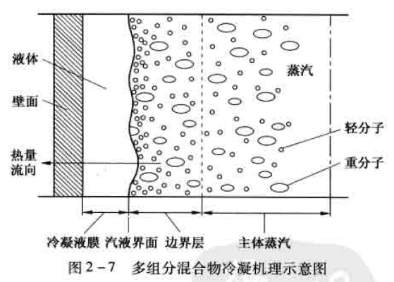

冷凝器
# 水平管内冷凝传热和压力降

## 水平管内冷凝液膜传热系数
水平管内冷凝一般用于高压场合,例如加氢装置进料换热器中反应流出物在管内冷凝,或者用于空气冷却器以及重沸器加热介质的冷凝。介质在管内冷凝时相互间影响很小,可以简化成单根管子进行分析。   

在对管内冷凝进行分析前,先定义一个流型参数$J_{tf}$，它是无因次气体速度,用此参数来判断冷凝过程是*重力控制*还是*剪力控制*。   
$$ J_{tf}=\dfrac{y\cdot G_t}{[d_i \cdot g \cdot \rho_v(\rho_l-\rho_v)]^{0.5}} $$
当$J_{tf}$&le;0.5时,为重力控制流动;当$J_{tf}$&ge;1.5时,为剪力控制流动;当0.5&lt;$J_{tf}$&lt;1.5时,为过渡区。    

水平管内冷凝在重力控制区可能出现分层流或弹状流,使计算的准确度低一些。因为分层的准确高度难以预测,而管子的排泄膜和分离层部分在传热系数上存在巨大的差异,使得传热与分离层高度的关系非常密切。   
水平管内冷凝过程两种典型的流态过渡历程如图。    
   
当蒸汽高速进入水平管内时形成雾状流、环状流或环雾流;随着蒸汽的冷凝气速降低了,两相流逐渐过渡到波状-分层流(低液体负荷下)或弹状流(高液体负荷下);当气速继续降低时,两相流逐渐过渡到块状流和分层流,完全冷凝后,管内充满液体。   

### 剪力控制流动
当$J_{tf}$&ge;1.5时,为剪力控制流动。    
水平管内冷凝时,剪力控制流动比重力控制流动更有效,因为冷凝液被吹扫出去,不会在管子底部集结。然而,有关实验数据表明,在高液体雷诺数时传热系数比理论预测值小。剪力控制时采用对流模型计算冷凝液膜传热系数。   
剪力控制冷凝传热系数$h_{si}$    
$$ h_{si}=h_{li}\cdot F_{ti} $$
$$ h_{li}=0.022(Re_{li})^{0.8}\cdot(Pr_l)^{0.4}\cdot\left(\frac{\lambda_l}{d_i}\right)\cdot\phi_i $$

*两相对流因子*$F_{ti}$:   
$$ F_{li}=\left(1+\frac{20}{X_{tt}}+\frac{1}{X_{tt}}\right)^m $$
0.4&le;m&le;0.5，一般取m=0.45，如果$Re_{li}$&lt;10000，m=0.5    

*Martineli参数*$X_{tt}$的定义如下：   
$$ X_{tt}=\left(\frac{1-y}{y}\right)^{0.9}\cdot\left(\frac{\rho_v}{\rho_l}\right)^{0.5}\cdot\left(\frac{\mu_l}{\mu_v}\right)^{0.1} $$

### 重力控制流动
当$J_{tf}$&le;0.5时,为重力控制流动,以努塞尔特冷凝模型式为基础。考虑到水平管内冷凝时管子下部将有凝液聚积,形成液池而淹没部分传热面积,对此进行修正即得到水平管内重力控制下的冷凝液膜传热系数关联式。   
$$ h_{gi}=1.47C_{lr}\cdot\lambda_l\cdot\left[\frac{\rho_l(\rho_l-\rho_v)g}{\mu^2_l}\right]^{\frac{1}{3}}(Re_{gi})^{\frac{1}{3}} $$
通常重力控制冷凝传热系数$h_{gi}$应该大于管内充满液体时的膜传热系数$h_{li}$。当$h_{gi}\lt h_{li}$时，令$h_{gi}=h_{li}$。  

### 过渡区
0.5&lt;$J_{tf}$&lt;1.5为过渡区。如果冷凝处在过渡区,先分别按剪力控制流动和重力控制流动计算出$h_{si}$和$h_{gi}$,然后进行经验插值。   
$$ h_{tt}=h_{si}-(1.5-J_{tf})\cdot(h_{si}-h_{gi}) $$

## 水平管内气相传热系数
多组分混合物及含不凝气介质冷凝过程同时存在着传热、传质和动量传递过程。下图是此过程的机理性步骤及近管壁区域中的温度、组分浓度分布。冷凝过程按下列步骤进行:   
   
所有组分向冷凝液膜界面扩散&emsp;&rArr;&emsp;汽相冷却到界面处汽体混合物的冷凝温度    
&rArr;&emsp;在界面处重分子冷凝、轻分子浓缩&emsp;&rArr;&emsp;轻组分向远离该界面方向扩散。  

通过液膜的热通量：  
$$ q_l=h_{cf}(T_{if}-T_w) $$
通过气相的热通量：    
$$ q_{sv} = h_{sv}(T_v -T_{if}) $$
局部热通量：    
$$ q_t=h_c(T_v-T_w) $$
各传热系数之间的关系：  

\begin{align}   
\frac{1}{h_c}&=\frac{1}{h_{cf}}+\frac{1}{h_{sv}}\cdot \frac{q_{sv}}{q_t} \\
\frac{1}{h_v}&=\frac{1}{h_{sv}}\cdot \frac{q_{sv}}{q_t} \\
\frac{1}{h_c}&=\frac{1}{h_{cf}}+\frac{1}{h_{v}} \\
h_v &= h_{sv} \cdot (1+\phi_d)
\end{align}     

当$Re_{vi}\ge2000$时气相处于湍流流动时，气相显热传热系数h_{sv}：    
$$ h_{sv}=0.023 \left(\frac{\lambda_v}{d_l}\right)\cdot(Re_{vi})^{0.8}\cdot(Pr_v)^{\frac{1}{3}} $$
当$Re_{vi}\lt2000$时气相处于层流或过度流态时，气相显热传热系数h_{sv}：    
$$ h_{sv}=2.42 \left(\frac{\lambda_v}{d_l}\right)\cdot\left(\frac{Re_{vi}\cdot Pr_v \cdot d_i}{L}\right)^{\frac{1}{3}} $$

扩散函数$\phi$是潜热通量与显热通量的函数,将汽相的传质与汽相显热传热关联起来。扩散函数$\phi$采用热平衡和汽、液平衡计算近似得到。   

## 水平管内冷凝压力降

浮头式冷凝器管程冷凝压力降由四个部分组成，分别为摩擦损失压力降$\Delta P_f$，动能损失压力降$\Delta P_m$，位能损失压力降$\Delta P_p$，出口管嘴压力降$\Delta P_N$。    

### 摩擦损失压力降
一般情况下，摩擦损失压力降在总压力降中占比例较大。  
浮头式冷凝器管程冷凝时的摩擦损失压力降与单相流类似，分为直管段和回弯压力降两部分：  
计算回弯压力降时认为气液两相在管箱中充分混合。  
在两相冷凝过程中，传热计算采用的是分段方法，而压力降采用不分段方法。直管段摩擦损失压力降的计算主要有两种模型，一是均匀流动模型，二是分离流动模型。  
当汽相分率$y_{av}$&ge;0.7时，汽液两相处于雾状流或环雾流，可以认为气液两相混合比较均匀，采用均匀流动模型计算。   
$$ \Delta P = \frac{1}{2}V^2\cdot\rho\cdot\frac{L}{d}\cdot f $$
$$ \Delta P_i = 2f_{tp}\cdot\frac{G_i^2}{\rho_{tp}}\cdot\frac{L\cdot N_{tp}}{d_i} $$
当汽相分率$y_{av}$&lt;0.7时，气液两相混合程度较差，采用均匀流动模型就不太合适，应采用分离流动模型。根据雷诺数的不同，分离流动模型又分为以液相为基础的两相分离流动模型和以气相为基准的两相分离流动模型。     
当$Re_{li}\ge 2000$时，按以液相为基准的两相分离流动模型计算：    
$$ \Delta P_i = 2f_{i}\cdot\frac{[G_i\cdot(1-y_{av})]^2}{\rho_{l}}\cdot\frac{L\cdot N_{tp}}{d_i}\cdot\phi_l^2 $$
当$Re_{li}\lt 2000$时，按以汽相为基准的两相分离流动模型计算：    
$$ \Delta P_i = 2f_{i}\cdot\frac{(G_i\cdot y_{av})^2}{\rho_{v}}\cdot\frac{L\cdot N_{tp}}{d_i}\cdot\phi_v^2 $$

## 动能损失压力降
两相流冷凝过程中由于流体流速的变化而产生动能损失。对冷凝过程而言,动能损失压力降为负值,即动能损失压力降的存在,使冷凝过程的总压力降减小。此值一般较小,如果允许总压力降不是特别小,可以不计算动能损失压力降。   

-----

最近的修改: {{ git_revision_date }}