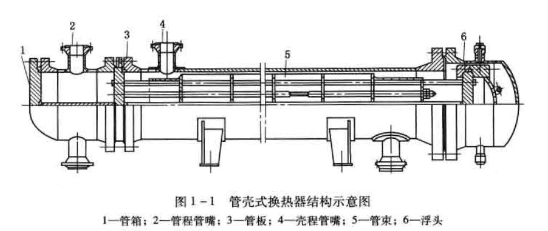
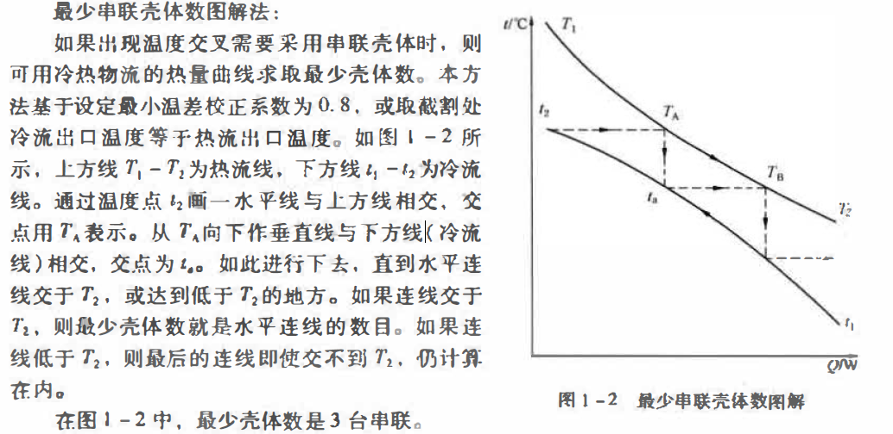

Shell & Tube Exchanger/管壳式换热器

## 结构
主要由外壳、管板管束封头组成
  


  | 类型     | 公称直径/mm | 管程数  | 管长/m          |
  | -------- | ----------- | ------- | --------------- |
  | 固定管板 | 159-1800    | 1,2,4,6 | 1.5,2,3,4.5,6,9 |
  | U型管    | 325-1200    | 2,4     | 3,6             |
  | 浮头式   | 325-1800    | 2,4,6   | 3,4.5,6,9       |
  
-----
## 设计考虑因素
### **流速**
流速提高-->提高传热系数，压降和功耗增加

  提高总传热系数，减少换热面积  
  减少管面结垢的可能  
```
一般针对传热阻力大的一侧提高流速，增大对流膜传热
```

  选择流速时，要考虑结构要求，避免磨损，壳程液体最大流速，一般约为管内液体流速的一半。
    
  
>一般油品管内最大流速2.7-3.0 m/s；  
>含固体颗粒的油品，如催化裂化油浆，最大流速不超过1.8m/s；   


  壳程气体最大允许速度表
  

### **压降**

  压降增加  

* 提高流速，从而增强传热，减少换热面积  
  
* 泵的操作费用增加  


换热设备中，一侧热阻明显高于另一侧，称为**控制热阻**

  壳程为控制侧：  
    增加折流板块数或减小壳径，增加流速减少热阻  
  管程为控制侧：  
    增加管程数来增加流速  

>管程变化为1，2，4，6，对压降影响较大  

  处理粘稠物料时，流体处于层流流动，走壳程。因为壳程流体流动更易达到湍流状态，增大传热速率，改进压降。

### **管壳程流体确定**
主要根据两流体的操作压力和温度、允许压降、结构、腐蚀性以及所需材料的选择考虑
适合走管程的流体有：  

* 水和水蒸气  
* 强腐蚀性流体  
* 有毒性流体  
* 容易结垢的流体  
* 高温、高压操作的流体  
  
适合走壳程的流体有：

* 塔顶熘出物的冷凝  
* 经类的冷凝或再沸  
* 关键压力降控制的流体  
* 粘度大的流体等  
  
当上述情况排除之后，介质走哪一程的选择，应着眼于提高传热系数和最充分的利用压力降上。  
  由于介质在壳程的流动容易达到湍流$(Re \ge 100)$，因而将粘度大的或流量小的流体，即雷诺数低的流体走壳程一般是有利。
  反之，如果流体在管程能够达到湍流时，则安排走管程比较合理。
  若从压力降的角度考虑，一般是雷诺数低的走壳程合理。

### **换热终温的确定**
换热终温一般由工艺过程的需要确定。  
  
  当换热终温可以选择时，其数值对换热器是否经济合理有很大的影响。  
  在热流出口温度与冷流出口温度相等的情况下，热械利用效率最高，但是有效传热温差最小，换热面积最大。  

另外在确定物流出口温度时，不希望出现温度交叉现象。即热流出口温度低于冷流出口温度。如果工艺流程中需要，则必须选择多台串联形式，可以用下述方法求解最少串联壳体数。
  
最少串联壳体数图解法 


### **设备结构的选择**
对于一定的工艺条件，首先应确定设备的形式，例如选择固定管板形式还是浮头形式等。当形式确定后，可参考表来选择换热设备的具体结构。


----

## 强化传热元件和设备的性能特点
强化传热总的目标概括有：  

* 在给定换热员下减少换热器尺寸；  
* 提高现有换热器的性能；  
* 减小流动工质的温差；  
* 或者降低泵的功率。  

### 螺纹管换热器
螺纹管属于管外拓展表面的类型，增加外侧传热面积。在相同管间距下，净错流面积比光管大。  


  螺纹管表面积比光管可扩展1.6-2.7倍,与光管相比，当管外流速一样时，因翅片表面的扩展，壳程传热热阻可以缩小相应的倍数。  
  管内流体的流速因管径的略减稍有增大，因此压力降略增加。  
  螺纹管比较适宜壳程传热系数相当于管程传热系数1/3-3/5的工况，这样可使总传热系数提高较多。  
  螺纹管结垢速率低，抗垢、抗腐蚀能力强于光管，因此操作周期长。  

### 波纹管换热器
以改变管内流体流动状态、增强传热效果的典型管形为波纹管、内插物管等。  
  波纹改变了管内壁滞层流的流动状态，减少了传热热阻，增强传热效果，但是也增长了摩擦阻力，需要优化波距、波高。

  $\delta$：壁厚，$d_0$：内径，$s$：波距，$\epsilon$：波高  

波纹管是管内凸肋管的典型代表，适用于管内传热阻力为控制侧的热交换过程，尤其是高粘流体处于层流区流动，其效果更加明显。  
在加工时管外被挤压成凹槽，由千波距较大、槽深较浅，故传热表面增加很少。但是波纹状的管壁可以增加流体的湍动，使得壳程传热系数和阻力也有不同程度的增加。  
波纹管实际上是一种双侧强化传热管型，管内强化传热效果突出、管外抵不上螺纹管。  

### 折流杆换热器
折流杆换热器、双弓板换热器、盘环式换热器、旋流式换热器等，都属于通过改变壳程管束支撑件、大幅度降低阻力提高流速或改变流动方式从而达到强化传热的目的。  
--

折流杆换热器是将管束的支撑件由弓形折流板改为杆系支撑而得名，具有很好的防疫性能。壳程流体也由错流变成顺流，因此壳程流体流动阻力大幅度下降。  
在等压力降下，折流杆换热器比单弓板换热器管外膜传热系数可提高一倍以上。  
虽然轴向流传热系数一般偏低，但是加上折流杆后，流体经过这些杆系产生脱体现象，在杆后产生波涡尾流（又称涡街）。这些涡街改善了轴向流传热，流速越大湍流越激烈。  
在设计折流杆换热器时，对设备直径等参数需要进行优选，以求最大的发挥它的长处。  

### 双、三弓形折流板

管束流体呈顺、错流流动，克服了单弓形板换热器壳程流体因180°造成的死区，以及阻力大、易震动等缺陷。  
维持相同的壳程压降下，一般可将流速提高1.5倍以上。
壳体流动较为复杂，需要采用**流路分析法**进行计算。


-----


最近的修改: {{ git_revision_date }}