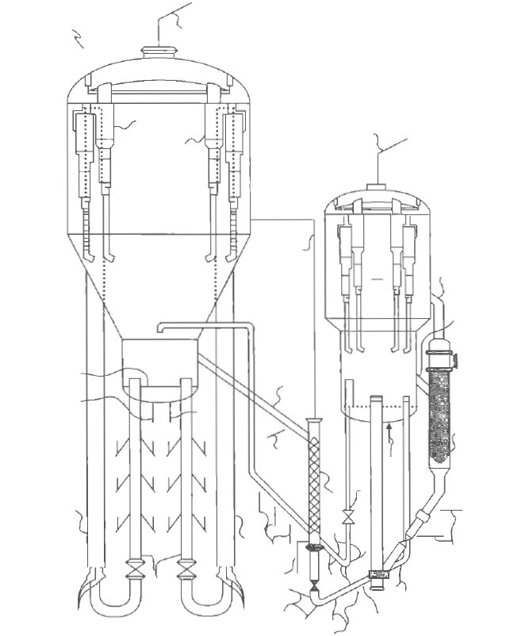

# 甲醇制烯烃技术的研究与发展

甲醇制汽油(methanol to gasoline, MTG)过程和甲醇制烯烃(methanol to olefin, MTO)过程为石油替代描绘了可能的解决途径。  

## MTO技术在国外的研发情况

### Mobil公司的早期研究
  分子筛的形状选择性效应对转化产物的分布起到了限制作用，中孔ZSM-5 分子筛和ZSM-11 分子筛的产物可以集中在汽油馏分，提出了甲醇制烯烃的技术概念。   

### ExxonMobil的MTO技术
ExxonMobil 公司公开的MTO反应工艺专利覆盖面很广，包括早期的密相床反应器到后来的提升管反应器。    
其提升管反应器包括单提升管、双提升管和多提升管等多种型式。  

双提升管反应－再生系统采用了两个相同的提升管反应器，其顶部均与一个大型沉降器相连，用千收集反应后的催化剂颗粒。催化剂颗粒在沉降器顶部通过气固旋风分离器与产品气分开。沉降器中收集到的催化剂一部分循环返回提升管反应器。由于提升管反应器中催化剂**停留时间仅为几秒**，反应气体和催化剂接触时间短，催化剂结碳量少，因此催化剂循环可以增加催化剂结碳量。同时，为了保持催化剂活性，一部分催化剂颗粒从沉降器中被直接送到再生器烧炭再生。    

### UOP/Hydro的MTO技术及与烯烃裂解的联合技术
UOP/HydroMTO 技术推荐的工艺流程    
     

UOP公司在MTO工艺开发中充分利用了其在FCC再生器设计方面的优势，采用了快速流化床作为MTO反应器，鼓泡床作为MTO再生器。   
UOP公司提出了MTO工艺结合烯烃裂解过程(olefin cracking process,OCP)工艺，进一步提高乙烯、丙烯的选择性。技术上，MTO与OCP的结合是进一步利用MTO反应副产的C4以上烃类，将其催化裂解制乙烯、丙烯。基于催化裂解的原理，其裂解产
物必然富含丙烯。    

### 德国鲁奇公司的甲醇制丙烯技术
基于传统的ZSM-5分子筛，德国Lurgi公司发展出了富产丙烯的改性ZSM-5催化剂，开发了甲醇制丙烯(MTP)工艺。反应器采用固定床，工艺流程与20世纪80年代在新西兰建成的甲醇制汽油(MTG)装置基本一样。甲醇原料首先在固定床预反应器与酸性
催化剂进行反应，生成二甲醚、甲醇和水蒸气的平衡化合物，该混合物之后在串联的固定床反应器中千450~500°C条件下进行转化生成以丙烯为主的低碳烯烃混合物。   
由于甲醇转换为烯烃是强放热反应，因此固定床反应器还需要采用复杂的多级取热，以控制反应器温度。固定床反应器沿床层的压力降比较大并且分布不均匀，对设备要求也较高。此外，在进料量相同的情况下，固定床反应器的尺寸也相对较大。    

## 国内MTO研究
### 大连化学物理研究所MTO
#### 固定床MTO
固定床MTO中试流程
为了避免反应器床层温升过大和及时移出反应热，采用稀释的甲醇(30wt%）为反应原料，同时利用甲醇脱水反应器(y-Ah03 催化剂，后改为分子筛催化剂）先将甲醇转化为二甲酰（实际物料为甲醇、水、二甲酪的平衡混合物）以预先去除部分反应热。    
固定床MTO技术基于改性ZSM-5催化剂，虽然证明是成功的，但是，乙烯的选择性和乙烯+丙烯选择性偏低。   

#### 流化床MTO
MTO的核心技术之一是催化剂，催化剂的性质和性能将主要地决定着MTO新工艺技术的发展方向。    
20世纪80年代，美国联合碳化物公司的分子筛研究人员发现了磷酸硅铝一类新型分子筛(SAPO)，作为新催化材料对甲醇转化具
有的特殊意义。大连化物所成功合成了SAPO-34分子筛，并首次报道了SAPO-34分子筛用千甲醇转化制烯烃的效果。    
主要的研究成果为以下儿点。  

1. 在基础研究方面，明确了SAPO-34分子筛的合成机理和分子筛的组成、结构、性质、催化性能之间的关系，找到了通过改变分子筛合成的条件控制其组成和催化性能的途径    
2. 成功合成出了6种小孔SAPO分子筛，发展了SAPO-34分子筛的廉价合成新技术    
3. 研制出了新一代甲醇/二甲醚制低碳烯烃的催化剂      

2004年，在国家发改委和陕西省委省政府的支待下，大连化物所与新兴能源科技有限公司、中石化洛阳工程有限公司合作进行流化床工艺的甲醇制烯烃技术(DMTO)工业性试验，建设了世界第一套万吨级甲醇制烯烃工业性试验装置。2006年2月实现投料试车一次成功，累积平稳运行近1150h。  

为进一步提高低碳烯烃产率，在DMTO基础上，大连化物所提出了将甲醇转化与其产物中C4以上组分的催化裂解采用同一种催化剂进行反应耦合的DMTO-II技术方案。     
根据甲醇转化反应和$\ce{C4+}$转化反应的特点，设计建设了一套中型循环流化床装置，该装置两个反应器共用一个再生器，两个反应器可以分别进不同的原料，分别进行甲醇转化和高烯烃混合C4烯烃转化反应。

---------