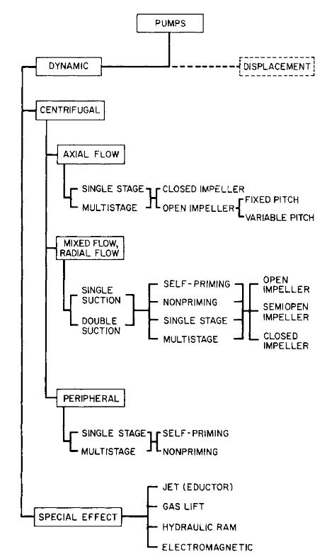
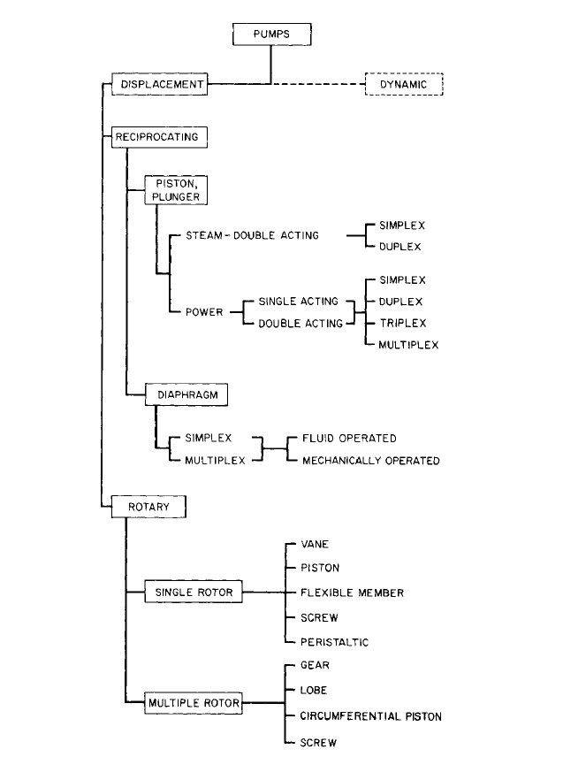

泵/Pump

## 泵的分类
CLASSIFICATION OF PUMPS

泵可以分成两大类：      

1. 动态泵dynamic   
    能量连续地施加，增加泵内液体的速度，超过出口速度，速度差$\rightarrow$出口压力增大;  
2. 容积泵displacement   
    能量通过力的作用，周期性地向多个含流体的封闭运动界面施加，增加压力，达到输送液体通过阀门或管件直至排出管线所需的压力。  

动态泵可以再细分为几种类型的离心式和其他特殊作用泵。    
     

!!! note ""   
    Centrifugal`离心泵`； Axial Flow`轴流泵`； Mixed Flow`混流泵`； Radical Flow`径流泵`；  Impeller`叶轮`； Self-priming`自吸`；  Nonpriming`非注液`；  Peripheral`旋涡泵`；  Hydraulic Ram`液压泵` 

依据压力产生元件的自然运动状态， 容积泵基本上分成往复式和回转式两类。每一种主要的分类都可以再进一步细分为几种具有商业价值的特殊类型。    

    

!!! note ""   
    Reciprocating`往复泵`； Piston Plumger`活塞泵/柱塞泵`； Simplex`单缸`； Duplex`双缸`；  Diaphragm`隔腊泵`； Rotary`回转泵`； Rotor`转子`； Vane`叶片`； Screw`螺杆`； Peristatic`蠕动`； Gear`齿轮`； Lobe`罗茨`； Circumferential piston`环形活塞`

炼油设置中，离心泵使用最广，占装置泵的绝大多数，其次是往复泵、转子泵和旋涡泵。  
根据工艺条件并确保生产过程 的正常进行，对炼油装置工艺用泵提出下列要求：     

1. 对于输送易燃或易爆介质的泵，要求泵密封可靠，电动机为防爆或隔爆型；对某些有毒戒指，泵的密封要求更为严格；     
2. 工艺设备中油品大都处于气液平衡状态，要求泵的吸入性能好，并采取灌泵措施；   
3. 某些油品和化学介质具有腐蚀性和冲蚀性，要求耐腐蚀和耐磨损；   
4. 为了连续可靠的运转，应采用专门的冷却、密封盒润滑性能。   

-----

最近的修改: {{ git_revision_date }}